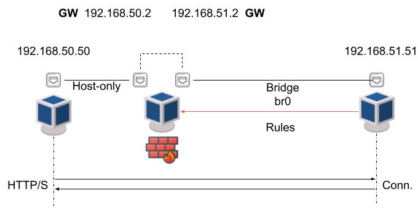

# CyberChain

CyberChain is a prototype that proposes the adoption of Blockchain and edge computing
to ensure data availability (and fast recovery of functionalities) by spreading topology
information and access rules in a peer-to-peer and secure fashion. In addition, the adoption
of the Blockchain pushes for a participative validation of topology information and
non-repudiability of issued commands, based on consensus algorithms reducing the
risk of injection of fake information by compromised nodes.
This project is born from the increasing integration of IT and OT environments that
is pushing towards dynamicity and connectivity openness of industrial solutions, paving
the way for the fourth industrial revolution. However, as demonstrated by recent standardization
efforts of international organizations such as NIST and IEC, there is the need of identifying
and enforcing suitable management solutions ensuring the cyber-resiliency of industrial
environments, also in case (part of) nodes are compromised or the network partitioned.

## Requirements

For the cyber security part we realize a simple wrapper for the REST API of several
gateways/firewall, for example OPNsense, FortiGate and iptables.
For the wrapper of FortiGate we took inspiration from the [PyFortiAPI](https://www.github.com/jsimpso/pyfortiapi)
project.

We have test this wrappers with Python 3.6.9 and, for install a specific version of Python,
you can use [pyenv](https://github.com/pyenv/pyenv).

To test this project you can create an environment that has its own installation
directories and it doesn’t share libraries with other virtualenv environments.

```bash
python -m venv .venv  # create virtual environment
source .venv/bin/activate  # activate the Python environment
pip install -r requirements.txt  # install all Python libraries
```

## Blockchain

### Create Fabric Network

First of all you need to create cryptographic material (x509 certs and signing keys)
for your various network actors modifying the [crypto-config.yaml](fabric_v2/crypto-config.yaml)
file and using the cryptogen tool to generate them.
Now you need to create the configuration artifacts modifying [configtx.yaml](fabric_v2/configtx.yaml)
file which contains the definitions for the sample network and using the configtxgen tool.
In this case, the files that you'll create are:

* orderer genesis block;
* channel configuration transaction;
* five anchor peer transactions (one for each Peer Organization: orgAgent, orgCtrl, orgGw1, orgGw2, orgGw3).

The profiles used are:

* "**OrgsSubChannel1**" to create channel configuration with three organizations (Agent, Controller and Gateway);
* "**OrgsChannelGw**" to create channel configuration with four organizations (Controller and three Gateway);
* "**MultiNodeEtcdRaft**" to create the genesis block of network configuration.

*Remember: Pay attention to the “Profiles” section at the bottom of `configtx.yaml` file.*

After that, you can run the network. You will notice that will be started one peer and
one CAs for each organization and 5 Raft orderers (for the quorum). The image used is
v2.3.1 for all peers and latest for CAs.

*WARNING: We deployed the peers to three different servers with an orderer on each.*

### Create channel

To create the channel, we used the CLI [fabric-tool](https://github.com/hyperledger/fabric-cli)
(latest version).

For the following CLI commands against peer0.orgGw1.$NETWORK_NAME.com CLI to work,
you need to preface four environment variables given below. These informations are
essential to indicate to the cli which peer it must connect. In this case:

```
OrgGw1
- CORE_PEER_MSPCONFIGPATH=$PATH/msp
- CORE_PEER_ADDRESS=peer0.orgGw1.$NETWORK_NAME.com:7051
- CORE_PEER_LOCALMSPID="OrgGw1MSP"
- CORE_PEER_TLS_ROOTCERT_FILE=$PATH/ca.crt
```

Now you can execute the command below to create a channel:

```
peer channel create -o orderer.$NETWORK_NAME.com:7050 -c $CHANNEL_NAME -f $PATH/$CHANNEL.tx --tls --cafile $PATH/tlsca.$NETWORK_NAME.com-cert.pem
```

After that you can join OrgGw1 peer to the channel:

```
peer channel join -b $CHANNEL_NAME.block
```

These operations must be performed for all organizations.

### Anchor peer update

At this point you need to update the anchor peers as follows:

```
peer channel update -o orderer.$NETWORK_NAME.com:7050 -c $CHANNEL_NAME -f $PATH/OrgGw1MSPanchors.tx --tls --cafile $PATH/tlsca.$NETWORK_NAME.com-cert.pem
```

### Install the chaincode

First, you need to install the Go (in this case) chaincode on every peer that will
execute and endorse your transactions.
The members of the channel need to agree the chaincode definition that establishes
chaincode governance.

You need to package the chaincode before it can be installed on peers.

```
peer lifecycle chaincode package $CHAINCODE.tar.gz --path $PATH/chaincode/$CHAINCODE --lang golang --label $CHAINCODE_1.0
```

After that, you need to provide a chaincode package label as a description of the
chaincode. Then you can approve the chaincode definition:

```
peer lifecycle chaincode approveformyorg --channelID $CHANNEL_NAME --name $CHAINCODE --version 1.0 --package-id $CC_PACKAGE_ID --sequence 1 --tls --cafile $PATH/tlsca.$NETWORK_NAME.com-cert.pem
```

Now we provided a **--signature-policy** argument to the command above to set the
chaincode endorsement policy. In the sub-channel case, the policy will require an
endorsement from a peer belonging to 2 out of **OrgGw1, OrgCtrl AND OrgAgent**
(i.e. three endorsements).

Since all channel members have approved the definition, you can now commit it to the channel as follows:

```
peer lifecycle chaincode commit -o orderer.$NETWORK_NAME.com:7050 --channelID $CHANNEL_NAME --name $CHAINCODE --version 1.0 --sequence 1 --tls --cafile "$PATH/tlsca.$NETWORK_NAME.com-cert.pem" --peerAddresses peer0.orgGw1.$NETWORK_NAME.com:7051 --tlsRootCertFiles "$PATH/ca.crt" --peerAddresses peer0.orgCtrl.$NETWORK_NAME.com:10051 --tlsRootCertFiles "$PATH/ca.crt"      --peerAddresses peer0.orgAgent.$NETWORK_NAME.com:11051 --tlsRootCertFiles "$PATH/ca.crt"
```

Now you can invoke the chaincode.

*WARNING: To resolve the logical host names, we configured the /etc/hosts file*

## Gateway

As previously mentioned, we realize a basic wrapper for:

* Fortigate, '[fortinet_api](fortinet_api)' directory;
* iptables, '[iptables_api](iptables_api)' directory;
* OPNsense, '[opnsense_api](opnsense_api)' directory.

### Scenario

For our test, we used OpenStack platform with two subnets and three instances (two hosts and
one gateways), how you can see in the above image. All instances have 1 vCPU and 1 GB of RAM.



To verify the time required to apply a new access rule, we consider the case of a single
access rule. In particular, we consider the case of a node with TCP traffic allowed only on port 80.
A new access rule imposes that only TCP traffic on port 443 is allowed, therefore it is required
to remove the previous rule and then to add the new one.

### How it works

For reaching the goal to quantitatively verify the latency to apply a new access rule,
first of all you need to modify the [configuration.ini](configuration.ini) with
the settings of each gateway.

Later you can test the execution with the following commands:

```bash
python fortigate_api/main.py
python iptables_api/iptables_cmd_invoke.py
python opnsense_api/main.py
```

After execution, you can find all the timings collected in the CSV present on the root project.
